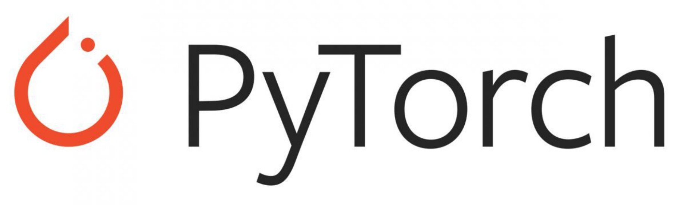

# 이웃집 토토치 1조 🔥

## 🗒️ 구성원

김상범  
손진아  
신관수  
안형준  
이지수  

 

## 🗒️ 일정표
| 일정         | Link            | Descript                     |
| :---------:   |  :-------------------:        |  :---------: |
| 1일차        | [Day1: 파이토치 시작하기](https://github.com/AIFFEL-GN-2nd/TotochTeam1/blob/main/day_1/day1_%EC%8B%A4%EC%8A%B5.ipynb) | Tensor, Autograd, DataLoader  |
| 2일차        | [Day2: 신경망 구조 설계(MNIST)](https://github.com/AIFFEL-GN-2nd/TotochTeam1/blob/main/day_2/day_2_%5B%EC%9D%B4%EB%A6%84%5D.ipynb)     |  nn.Module, sequence, optimization |
| 3일차        | [Day3: 신경망 구현 실습(CIFAR-10)]() |  augmentation, dataloader, wandb |
| 4일차        | [Day4: 전이학습(CIFAR-10)]() | Transfer Learning, sweeps  |

 
test
